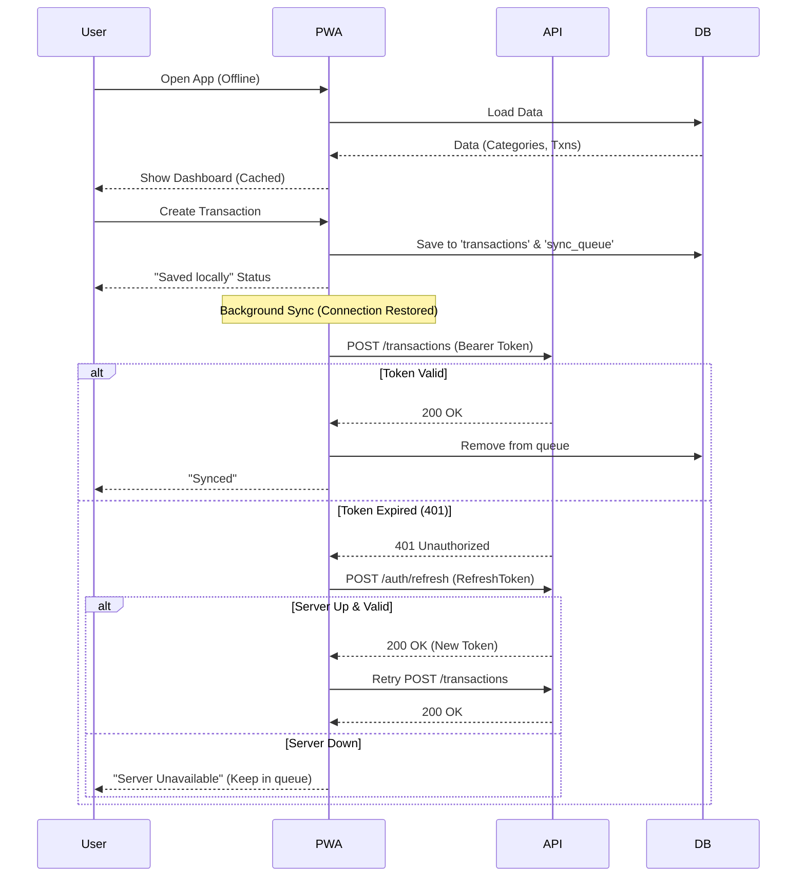

# Offline-Aware Authentication Flow

## Overview

In the Hybrid Hosting architecture, the frontend (Netlify PWA) must work independently of the backend (Home Server) availability. Authentication is the critical link that must degrade gracefully. This document outlines the authentication lifecycle for this environment.

## 1. Core Principles

1.  **Strict Separation**: The PWA (Frontend) never trusts the Backend availability.
2.  **Optimistic Offline Usage**: Authenticated users can continue using the app (Writes/Reads) offline indefinitely until they explicitly log out or the refresh token expires.
3.  **Secure Storage**: Tokens are stored securely (`httpOnly` cookies preferred, or `localStorage` as fallback for PWAs requiring offline access if cookies are not accessible by SW easily). *For this implementation, we use `localStorage` for simplicity in PWA context, but robust security would use `httpOnly` Cookies + Backend Proxy or specialized storage.*

## 2. Token Lifecycle

Current implementation uses **JWT Access Tokens**. To support long-term offline/intermittent usage, we introduce **Refresh Tokens**.

- **Access Token**: Short-lived (e.g., 15-60 mins). Used for API requests.
- **Refresh Token**: Long-lived (e.g., 30 days). Used to obtain new Access Tokens. Sits on the device.

## 3. The Offline Auth Flow

### A. Initial Login (Online Required)
1.  User enters credentials.
2.  Backend verifies and issues `AccessToken` + `RefreshToken`.
3.  Frontend stores:
    - User Profile -> IndexedDB (for offline UI)
    - Tokens -> Secure Storage / LocalStorage
4.  App enters **Authenticated State**.

### B. Offline / Intermittent Usage
When the Backend is **down** or Client is **offline**:

1.  **Reads**: Served from IndexedDB. No Auth check against server.
2.  **Writes**: Queued in IndexedDB (`sync_queue`). No Auth check against server.
3.  **Navigation**: Protected routes check *local state* only. ("Is there a token string?" -> Yes -> Allow).

### C. Sync & Re-Auth (Background)

When `SyncEngine` attempts to push/pull data:

1.  **Request**: `SyncEngine` calls API with `AccessToken`.
2.  **Success (200)**: Sync works. `AccessToken` is valid.
3.  **Expiry (401)**: Server rejects `AccessToken`.
    *   *Action*: `ApiClient` intercepts 401.
    *   *Action*: Calls `/auth/refresh` with `RefreshToken`.
    *   **Case 1: Server Available & Refresh Valid**:
        *   Backend issues new `AccessToken`.
        *   `ApiClient` retries the failed Sync Request. (Seamless to user).
    *   **Case 2: Server Unavailable (Network Error / 500)**:
        *   Refresh request fails.
        *   *Action*: `SyncEngine` pauses. Status -> `ERROR` or `OFFLINE`.
        *   *User State*: User remains "Logged In" locally. No detailed error shown, just "Server Unavailable". app works.
    *   **Case 3: Refresh Invalid (401 on Refresh)**:
        *   Session Expired (e.g., user revoked access or 30 days passed).
        *   *Action*: **Force Logout**.
        *   Clear local tokens.
        *   Clear sensitive local data (Optional, based on security policy. Usually keeping local data until next login is risky but user-friendly. Safer to clear).
        *   Redirect to Login.

## 4. Visual Diagram

## 5. Implementation Checklist

- [x] **Frontend**: `api-client` interceptor for 401/Retry.
- [x] **Frontend**: `SyncEngine` queue logic.
- [ ] **Backend**: `/auth/refresh` endpoint (Needs implementation).
- [ ] **Backend**: Update `/auth/login` to return Refresh Token.

This architecture ensures the user never sees an error during normal usage, even if the "Server" is a PC at home that is turned off.
